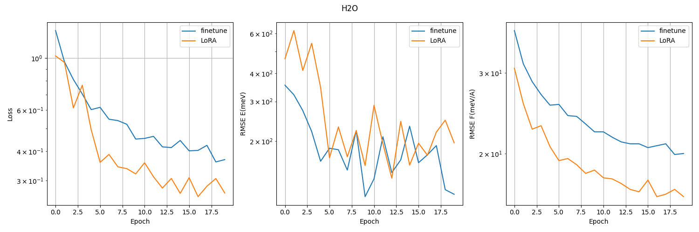
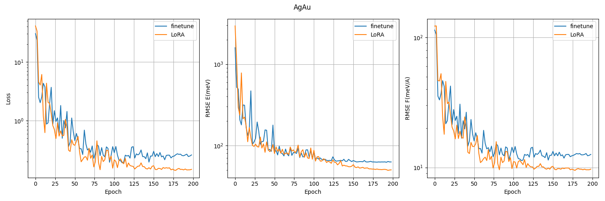
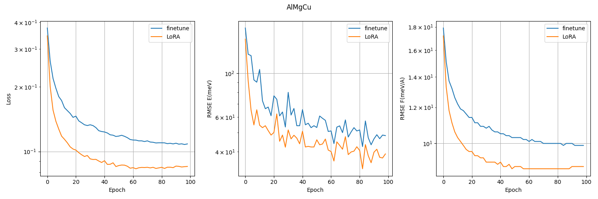
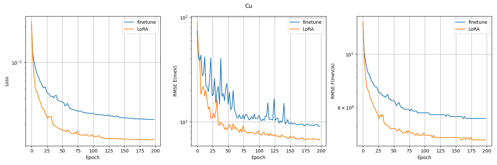
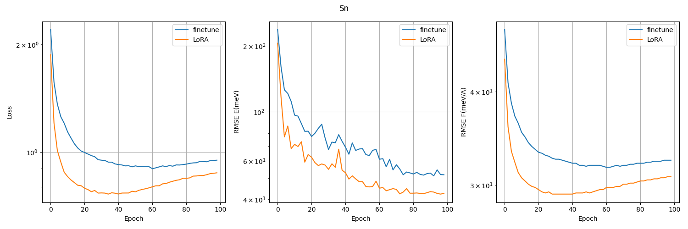
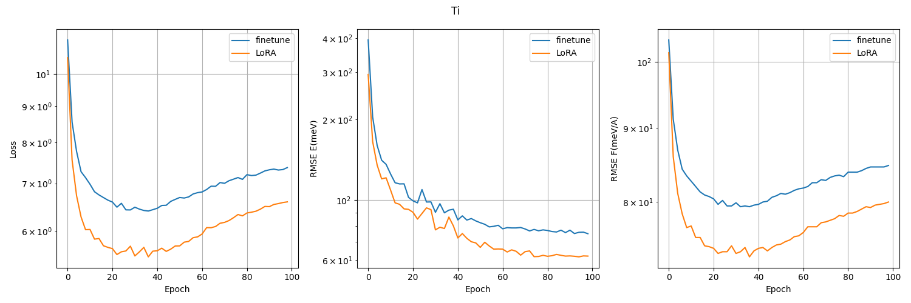
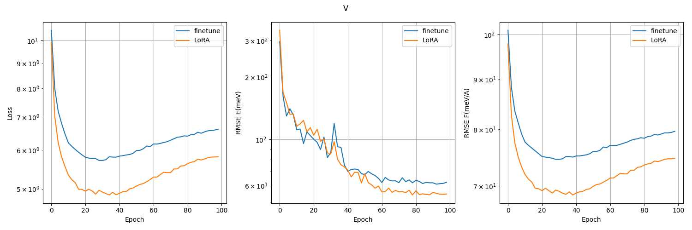
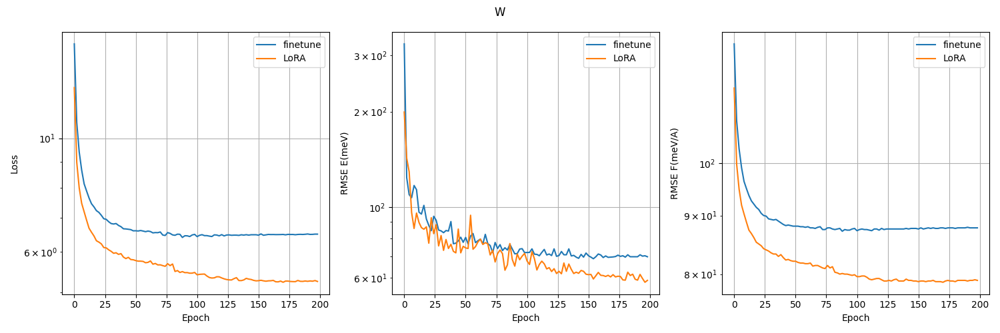
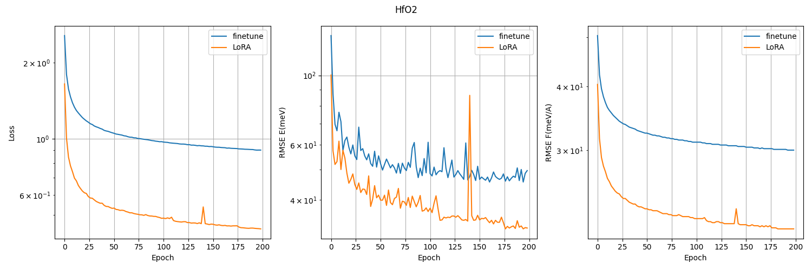

# inorganic

## 数据集

SSE-PBE https://www.aissquare.com/datasets/detail?pageType=datasets&id=146

H2O-PD https://www.aissquare.com/datasets/detail?pageType=datasets&id=137

AgAu-PBE https://www.aissquare.com/datasets/detail?pageType=datasets&id=152

AlMgCu https://www.aissquare.com/datasets/detail?pageType=datasets&id=139

Cu https://www.aissquare.com/datasets/detail?pageType=datasets&id=132

Sn https://www.aissquare.com/datasets/detail?pageType=datasets&id=129

Ti https://www.aissquare.com/datasets/detail?pageType=datasets&id=133

V https://www.aissquare.com/datasets/detail?pageType=datasets&id=135

W https://www.aissquare.com/datasets/detail?pageType=datasets&id=136

HfO2 https://www.aissquare.com/datasets/detail?pageType=datasets&id=145

## 相关文献

https://arxiv.org/abs/2312.15492

## 预处理

使用 [dp_convert.py](../scripts/dp_convert.py) 将数据从 deepmd 格式转换为 xyz 格式。其中 pathlist 为需要转换的路径列表。

训练集和验证集遵循官方设置。

## 训练

各个以数据集命名的文件夹下的 finetune/ 是全参数微调，LoRA/ 是 ELoRA 微调。

## 测试

### loss 曲线

使用 [loss.py](../scripts/loss.py) 绘制 loss 曲线

### 精度

logs/ 中默认统计的是 RMSE energy (E, meV) and RMSE force (F, meV/Å) 的结果，RMSE energy (E, meV/atom) 可以从 results/ 中的详细日志中读取。

**注意**：训练时使用了 early stop，应该从 results/ 中读取对应 epoch 的结果。

**Root-mean-square errors of energy (E, meV/atom) and force (F, meV/Å) on the dataset.**

|                            | NequIP | Allegro |  DPA2   |   MACE   | MACE (Full-parameter) | MACE (ELoRA) | MACE (MPtrj) |
| :------------------------: | :----: | :-----: | :-----: | :------: | :-------------------: | :----------: | :----------: |
|        SSE-PBE,  E         |  1.6   |   1.0   |   1.4   |   1.8    |        **0.3**        |   **0.3**    |    243.5     |
|        SSE-PBE,  F         |  41.1  |  47.8   |  50.3   |   29.9   |         16.9          |   **14.2**   |    167.4     |
|         H2O-PD,  E         |  0.9   |   OOM   | **0.5** |   79.9   |          0.6          |     0.8      |    213.1     |
|         H2O-PD,  F         |  27.1  |   OOM   |  24.7   |   29.7   |         19.9          |   **16.1**   |    1924.9    |
|    Ag $\cup$ Au-PBE,  E    |  42.3  |  39.2   | **2.4** |  369.1   |         10.6          |     8.1      |    534.6     |
|    Ag $\cup$ Au-PBE,  F    |  43.8  |  58.9   |  17.8   |   34.5   |         11.3          |   **9.5**    |    530.6     |
| Al $\cup$ Mg $\cup$ Cu,  E |  38.0  |  18.3   | **2.1** |   7.7    |          3.0          |     2.2      |    919.1     |
| Al $\cup$ Mg $\cup$ Cu,  F |  48.3  |  40.6   |  19.1   |   42.9   |          9.9          |   **8.8**    |    227.9     |
|           Cu,  E           |  6.2   |   1.3   |   1.2   |   38.8   |          0.6          |   **0.4**    |    381.1     |
|           Cu,  F           |  16.7  |   8.9   |   8.9   |   13.6   |          5.4          |   **4.4**    |    190.3     |
|           Sn,  E           |  18.2  |   5.6   | **4.1** |    /     |          4.9          |     4.6      |    595.6     |
|           Sn,  F           |  62.2  |  40.2   |  54.4   |    /     |         31.7          |   **29.2**   |    164.9     |
|           Ti,  E           |  27.6  |   6.9   | **5.0** |   8.3    |          5.9          |     5.8      |    2668.2    |
|           Ti,  F           | 137.4  |  85.6   |  113.1  |   94.2   |         79.4          |   **73.3**   |    302.1     |
|           V,  E            |  8.8   |   4.2   | **4.1** |   14.2   |          4.4          |     4.3      |    128.9     |
|           V,  F            |  91.6  |  82.1   |  90.8   |  140.4   |         74.5          |   **68.6**   |    318.4     |
|           W,  E            |  20.8  | **4.0** |   5.6   |   15.6   |          6.1          |     4.7      |    3025.2    |
|           W,  F            | 160.4  |  101.6  |  108.1  |  181.2   |         87.2          |   **78.7**   |    893.6     |
|          HfO2,  E          |  1.5   |   1.4   |   1.0   |   2.3    |          0.5          |   **0.3**    |    635.8     |
|          HfO2,  F          |  58.8  |  64.0   |  54.2   | **14.7** |         30.0          |     21.0     |    223.8     |

|                                | MACE (Full-parameter) | MACE (Adapter) | MACE (Readout) | MACE (ELoRA) |
| :----------------------------: | :-------------------: | :------------: | :------------: | :----------: |
|             Cu,  E             |          0.6          |      4.4       |      5.6       |   **0.4**    |
|             Cu,  F             |          5.4          |      22.9      |      28.2      |   **4.4**    |
|             Sn,  E             |          4.9          |      27.6      |      30.8      |   **4.6**    |
|             Sn,  F             |         31.7          |      67.5      |      74.8      |   **29.2**   |
| Number of trainable parameters |        723866         |     169296     |      2192      |    176666    |

|                        | NequIP | Allegro | DPA2  |   MACE   | MACE (Full-parameter) | MACE (ELoRA) | MACE (MPtrj) |
| :--------------------: | :----: | :-----: | :---: | :------: | :-------------------: | :----------: | :----------: |
|        SSE-PBE         |  42.7  |  48.8   | 51.7  |   31.7   |         17.2          |   **14.5**   |    410.9     |
|         H2O-PD         |  28.0  |   OOM   | 25.2  |  109.6   |         20.5          |   **16.9**   |    2138.0    |
|    Ag $\cup$ Au-PBE    |  86.1  |  98.1   | 20.2  |  403.6   |         21.9          |   **17.6**   |    1065.2    |
| Al $\cup$ Mg $\cup$ Cu |  86.3  |  58.9   | 21.2  |   50.6   |         12.9          |   **11.0**   |    1147.0    |
|           Cu           |  22.9  |  10.2   | 10.1  |   52.4   |          6.0          |   **4.8**    |    571.4     |
|           Sn           |  80.4  |  45.8   | 58.5  |    /     |         36.6          |   **33.8**   |    760.5     |
|           Ti           | 165.0  |  92.5   | 118.1 |  102.5   |         85.3          |   **79.1**   |    2970.3    |
|           V            | 100.4  |  86.3   | 94.9  |  154.6   |         78.9          |   **72.9**   |    447.3     |
|           W            | 181.2  |  105.6  | 113.7 |  196.8   |         93.3          |   **83.4**   |    3918.8    |
|          HfO2          |  60.3  |  65.4   | 55.2  | **17.0** |         30.5          |     21.3     |    859.6     |