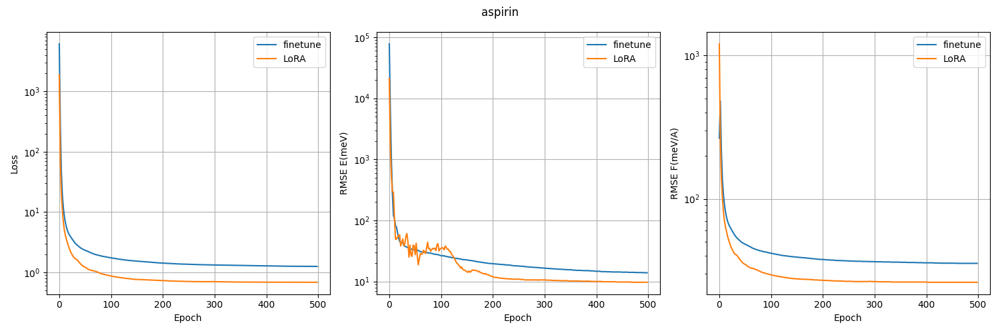
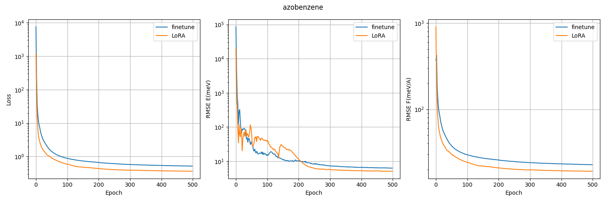
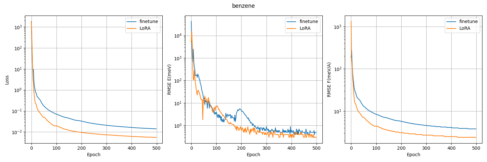
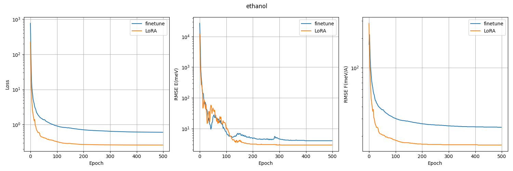
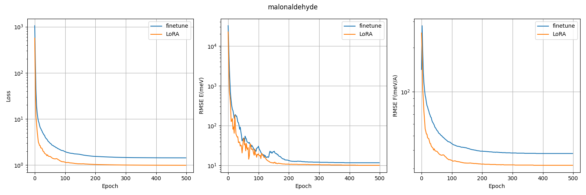
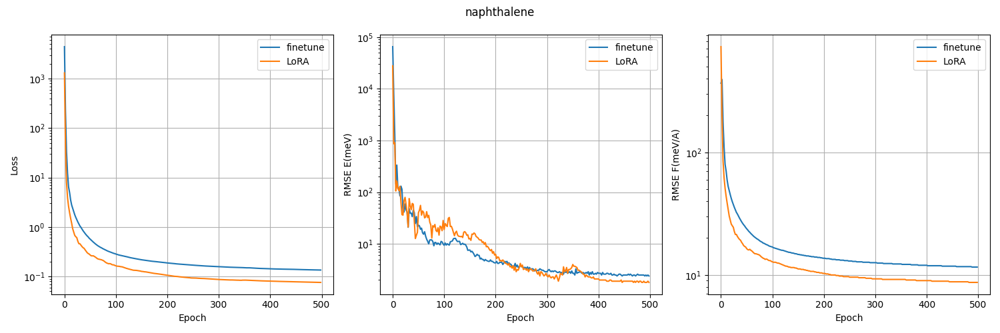
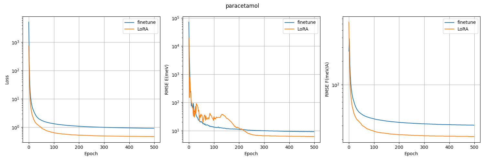
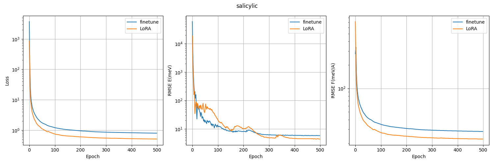
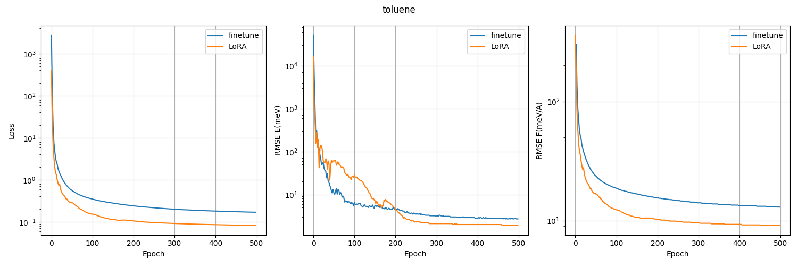
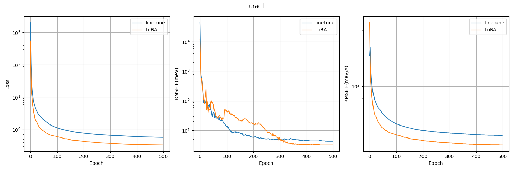

## rMD17

## 数据集

https://dx.doi.org/10.6084/m9.figshare.12672038

## 相关文献

https://arxiv.org/abs/2007.09593

## 预处理

使用 [convert.py](./convert.py) 将 numpy 格式的文件转换为 xyz 格式，随机划分训练集 (50)、验证集 (950)、测试集 (9000)。

## 训练

各个以数据集命名的文件夹下的 finetune/ 是全参数微调，LoRA/ 是 ELoRA 微调。

## 测试

### loss 曲线

使用 [loss.py](./loss.py) 绘制 loss 曲线

### 精度

logs/ 中默认统计的是 RMSE energy (E, meV) and RMSE force (F, meV/Å) 的结果，MAE energy (E, meV) and MAE force (F, meV/Å) 可以从 results/ 中的详细日志中读取。

**注意**：

1. 训练时使用了 early stop，应该从 results/ 中读取对应 epoch 的结果。

2. results/ 中记录的是验证集的结果，测试集的准确结果理论上应该用训练好的模型对测试集进行推理后统计得到。推理和统计相关文件在 [scripts](../../scripts/) 中。

**Mean absolute errors of energy (E, meV) and force (F, meV/Å) on the rMD17 dataset.**

|                   |   ACE   | NequIP | PACE | MACE | MACE (Full-parameter) | MACE (ELoRA) |
| :---------------- | :-----: | :----: | :--: | :--: | :-------------------: | :----------: |
| Aspirin, E        |  26.2   |  19.5  | 15.7 | 17.0 |         10.3          |   **7.3**    |
| Aspirin, F        |  63.8   |  52.0  | 37.4 | 43.9 |         23.6          |   **17.6**   |
| Azobenzene, E     |   9.0   |  6.0   | 6.7  | 5.4  |          4.7          |   **4.0**    |
| Azobenzene, F     |  28.8   |  20.0  | 17.5 | 17.7 |         15.1          |   **12.4**   |
| Benzene, E        | **0.2** |  0.6   | 0.6  | 0.7  |          0.4          |   **0.2**    |
| Benzene, F        |   2.7   |  2.9   | 3.3  | 2.7  |          2.4          |   **1.6**    |
| Ethanol, E        |   8.6   |  8.7   | 6.3  | 6.7  |          2.7          |   **2.1**    |
| Ethanol, F        |  43.0   |  40.2  | 25.4 | 32.6 |         13.9          |   **10.7**   |
| Malonaldehyde, E  |  12.8   |  12.7  | 11.5 | 10.0 |          7.3          |   **6.5**    |
| Malonaldehyde, F  |  63.5   |  52.5  | 57.3 | 43.3 |         25.3          |   **21.7**   |
| Naphthalene, E    |   3.8   |  2.1   | 2.1  | 2.1  |          1.8          |   **1.4**    |
| Naphthalene, F    |  19.7   |  10.0  | 9.7  | 9.2  |          7.8          |   **6.0**    |
| Paracetamol, E    |  13.6   |  14.3  | 10.1 | 9.7  |          6.9          |   **4.8**    |
| Paracetamol, F    |  45.7   |  39.7  | 29.3 | 31.5 |         20.4          |   **14.8**   |
| Salicylic acid, E |   8.9   |  8.0   | 7.0  | 6.5  |          4.2          |   **3.2**    |
| Salicylic acid, F |  41.7   |  35.0  | 29.2 | 28.4 |         17.8          |   **14.2**   |
| Toluene, E        |   5.3   |  3.3   | 2.7  | 3.1  |          1.9          |   **1.3**    |
| Toluene, F        |  27.1   |  15.1  | 12.0 | 12.1 |          8.6          |   **5.9**    |
| Uracil, E         |   6.5   |  7.3   | 5.9  | 4.4  |          2.6          |   **2.1**    |
| Uracil, F         |  36.2   |  40.1  | 26.8 | 25.9 |         14.7          |   **11.6**   |

**Root-mean-square errors of energy (E, meV) and force (F, meV/Å) on the rMD17 dataset.**

|                   | MACE (Full-parameter) | MACE (ELoRA) | MACE (OFF23) |
| :---------------- | :-------------------: | :----------: | :----------: |
| Aspirin, E        |         13.9          |   **9.7**    |   103366.1   |
| Aspirin, F        |         35.5          |   **26.2**   |    446.7     |
| Azobenzene, E     |          6.3          |   **5.1**    |   119339.0   |
| Azobenzene, F     |         22.7          |   **19.1**   |    476.1     |
| Benzene, E        |          0.5          |   **0.3**    |   58843.3    |
| Benzene, F        |          3.8          |   **2.4**    |    309.9     |
| Ethanol, E        |          4.0          |   **2.9**    |   34406.9    |
| Ethanol, F        |         24.6          |   **16.2**   |    439.8     |
| Malonaldehyde, E  |         11.7          |   **10.1**   |   39751.7    |
| Malonaldehyde, F  |         37.9          |   **31.5**   |    492.6     |
| Naphthalene, E    |          2.4          |   **1.8**    |   92335.3    |
| Naphthalene, F    |         11.6          |   **8.7**    |    371.0     |
| Paracetamol, E    |          9.2          |   **6.2**    |   94589.8    |
| Paracetamol, F    |         30.3          |   **21.7**   |    434.8     |
| Salicylic acid, E |          5.8          |   **4.4**    |   79533.8    |
| Salicylic acid, F |         28.2          |   **22.6**   |    463.4     |
| Toluene, E        |          2.7          |   **1.9**    |   71077.1    |
| Toluene, F        |         13.0          |   **9.1**    |    348.1     |
| Uracil, E         |          4.3          |   **3.2**    |   57754.0    |
| Uracil, F         |         23.9          |   **18.2**   |    474.9     |