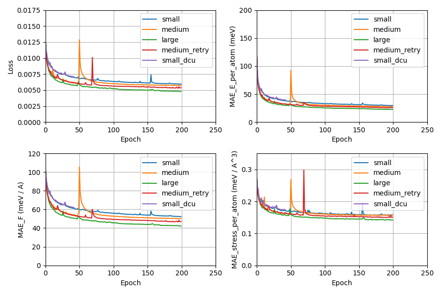
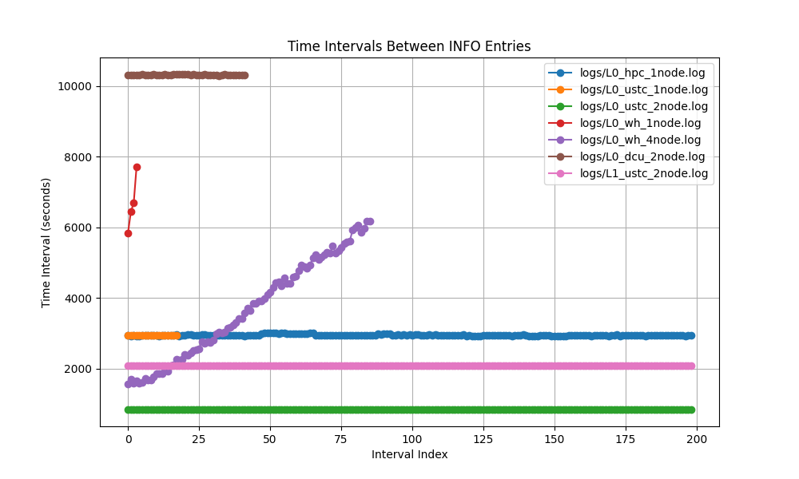

# MPtrj

## 数据集

https://github.com/ACEsuit/mace-foundations/releases/download/mace_mp_0/training_data.zip

## 相关文献

https://arxiv.org/abs/2401.00096

## 预处理

用 [merge.sh](./dataset/merge.sh) 将数据集合并成一个文件，然后用 [process.sh](./dataset/process.sh) 转换为 hdf5 格式。

## 训练

训练使用的脚本在 [scripts](./scripts/)

使用 [loss.py](./assets/loss.py) 画图

使用 [time.py](./assets/time.py) 统计训练时间

