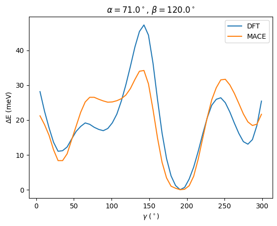
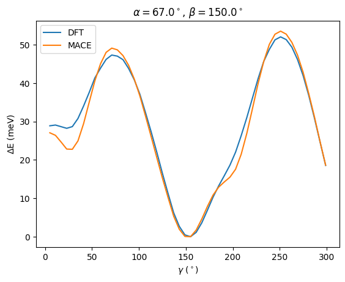
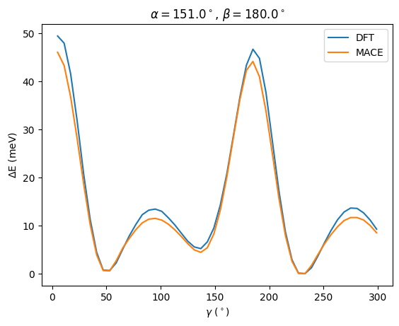
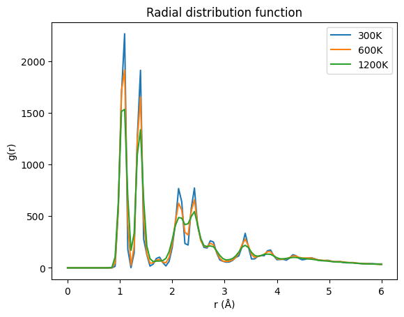

# 3BPA

## 数据集

https://github.com/davkovacs/BOTNet-datasets

## 相关文献

https://doi.org/10.1021/acs.jctc.1c00647

https://arxiv.org/abs/2205.06643 

## 训练

L 为 MACE 使用的等变消息的阶数，阶数越高网络越大，精度越高。

训练使用的脚本为：[run.sh](./run.sh)

训练仅在 300K 的数据集中进行，测试集包括 300K 600K 1200K dih（二面角扫描）。

## 测试

[eval_configs.sh](./eval_configs.sh) 使用训练好的模型在测试集上进行 Energy 和 Force 的计算，结果存入 tests/ 。

使用 [plot.ipynb](./plot.ipynb) 中计算 RMSE 的脚本得到在测试集中的结果如下 Energy (E, meV), Force (F, meV/Å)。

|             | *NequIP (L=3)* |  *MACE (L=2)*  | MACE (L=2) |
| :---------: | :------------: | :------------: | :--------: |
|  300K,   E  |   3.3 (0.1)    | **3.0** (0.2)  |    2.4     |
|  300K,   F  |   10.8 (0.2)   | **8.8** (0.3)  |    9.9     |
|  600K,   E  |   11.2 (0.1)   | **9.7** (0.5)  |    11.0    |
|  600K,   F  |   26.4 (0.1)   | **21.8** (0.6) |    25.3    |
|  1200K, E   |   38.5 (1.6)   | **29.8** (1.0) |    36.9    |
|  1200K, F   |   76.2 (1.1)   | **62.0** (0.7) |    81.9    |
| dih,      E |       -        | **7.8** (0.6)  |    16.5    |
| dih,      F |       -        | **16.5** (1.7) |    19.9    |

表格中斜体标题是论文给出的参考结果。

## 二面角扫描

在 [plot.ipynb](./plot.ipynb) 中参考论文中的二面角扫描方法进行计算的结果如下：

## RDF

使用测试数据集在 [plot.ipynb](./plot.ipynb) 中计算不同温度下的径向分布函数(RDF)结果如下：

