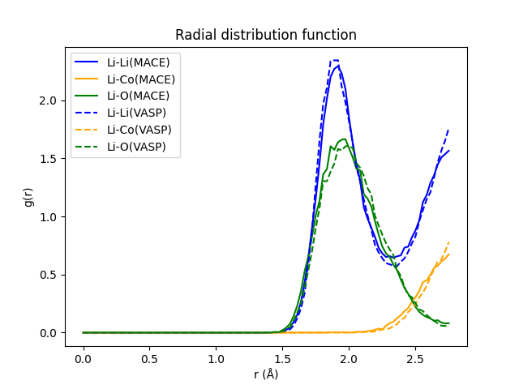
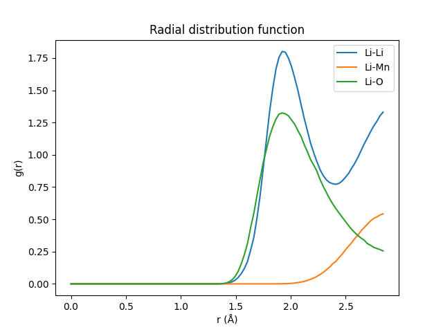
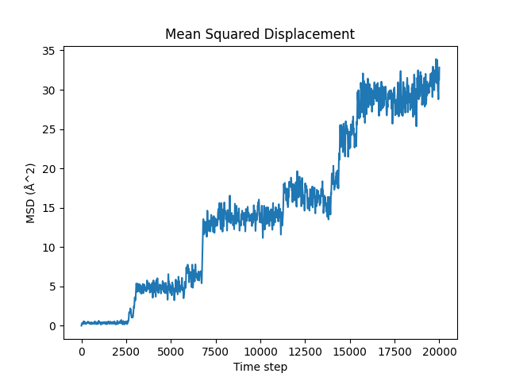

# CHGNet

对 CHGNet 论文中测试的几个数据集用 MPtrj-L2 模型进行分子动力学测试

## 相关文献

https://www.nature.com/articles/s42256-023-00716-3

## 脚本

[md.py](./md.py) 分子动力学模拟

[rdf.py](./rdf.py) 生成径向分布函数图像

[msd.py](./msd.py) 生成均方位移图像

[sigma.py](./sigma.py) 计算离子电导率

[temp.py](./temp.py) 生成温度变化图像

## Li9Co7O16

### rdf 图像

## LiGa(SeO3)2

### rdf 图像

2/result/rdf.png)

### msd 图像

2/result/msd.png)

### 锂离子电导率

Li ion conductivity: 0.010 mS/cm

## LiMnO2

### rdf 图像

### msd 图像

